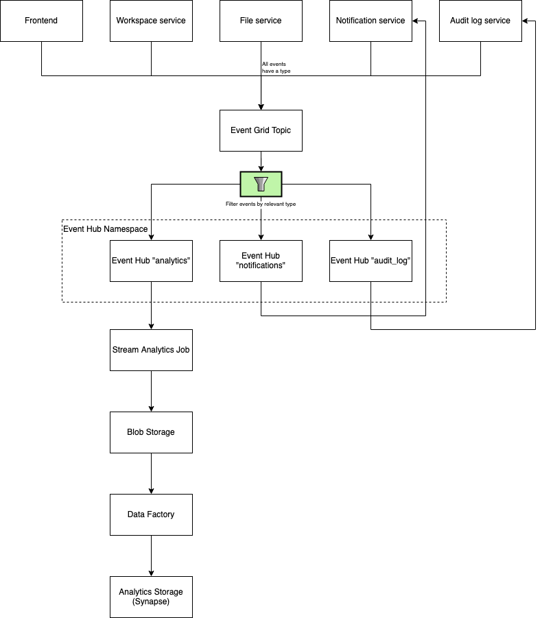

# Data Flow

## Events

Applications will publish events for every action they perform. These events can be used to extend the platform in various ways. The platform itself is going to use them for functionality like email notifications, audit logs or analytics. The data flow for events is described in this diagram:

## Analytics Data Mapping

The platform will use data from different sources to generate analytics data. This is going to be used to validate features and continuously improve the platform. The proposed analytics data mapping is described is this diagram:

